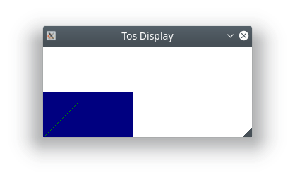

= Hosted Display Emulation
fatih <mfatihbakir@gmail.com>

When developing graphical applications, the ability to get fast
feedback is desired. However, on embedded targets, the turnaround
time can be quite high after a code change.

The hosted driver set provides a display emulator that exposes
a tos display abstraction.

Currently we only have an X11 backend. If X11 libraries aren't
available, the display emulator is not provided. For such cases,
painting to memory and dumping the contents to a file could be
a last-resort alternative.

== Usage

The target is provided as part of `arch_drivers`, but is not
available as part of `<arch/drivers.hpp>` due to the possible
unavailability on certain platforms.

A tiny example looks like this:

[source, cpp]
----
include::/examples/display/hosted.cpp[lines=7..14]
----

The constructor to the emulator takes the desired resolution.
In this case, we chose 296 by 128 pixels to emulate an 2.9 inch
e-paper display.

After construction, the emulator should create a window. Actual
drawing to the window is handled through the painter of the
display.

We draw a blue rectangle and a yellow line at the bottom left
of the display.

If everything goes smoothly, you should get an output like this:

