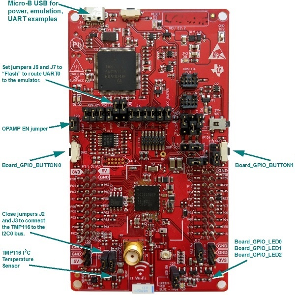

# CC3235S LAUNCHXL Settings and Resources

The CC3235S LAUNCHXL board contains a CC3235S device.

## Jumper Settings

* Set __RX__ and __TX__ to provide UART communications via the onboard USB debugger.

## Board Resources Used in Driver Examples

The following table lists the Board names of the resources used by
the driver examples, and their corresponding pins.  Note that there may be
other resources configured in the board files that are not used by any
driver example.  Only the example resources are listed in the table.

  |Board Resource|Pins|
  |--------------|:---|
  |`Board_ADC0`|P59  (Connect to analog signal)|
  |`Board_ADC1`|P60  (Connect to analog signal)|
  |`Board_CAPTURE0`|P04 |
  |`Board_CAPTURE1`|P05 |
  |`Board_GPIO_LED0`|P64  (__LED EN__ must be jumpered)|
  |`Board_GPIO_LED1`|P64  (__LED EN__ must be jumpered)|
  |`Board_GPIO_LED2`|P64  (__LED EN__ must be jumpered)|
  |`Board_GPIO_BUTTON0`|P04  (`SW2`)|
  |`Board_GPIO_BUTTON1`|P15  (`SW3`)|
  |`Board_I2C0`|P01 - `SCL`, P02 - `SDA`|
  |`Board_I2C_TMP`|P01 - `SCL`, P02 - `SDA`  (__SCL__ and __SDA__ must be jumpered)|
  |`Board_I2S0`|P50 - `XR1`, P53 - `CLK`, P62 - `CLKX`, P63 - `FSX`, P64 - `XR0`|
  |`Board_PWM0`|P01  (__LED EN__ must be jumpered)|
  |`Board_PWM1`|P02  (__LED EN__ must be jumpered)|
  |`Board_SD0`|P06 - `DATA`, P07 - `CLK`, P08 - `CMD`|
  |`Board_SDFatFS0`|P06 - `DATA`, P07 - `CLK`, P08 - `CMD`|
  |`Board_SPI0`|P05 - `CLK`, P06 - `MISO`, P07 - `MOSI`, P08 - `CS`|
  |`Board_SPI_MASTER`|P05 - `CLK`, P06 - `MISO`, P07 - `MOSI`, P08 - `CS`|
  |`Board_SPI_SLAVE`|P05 - `CLK`, P06 - `MISO`, P07 - `MOSI`, P08 - `CS`|
  |`Board_SPI_MASTER_READY`|P18|
  |`Board_SPI_SLAVE_READY`|P03|
  |`Board_UART0`|P57 - `RX`, P55 - `TX`  (UART provided through emulation, __RX__ and __TX__ must be jumpered)|
  |`Board_UART1`|P08 - `RX`, P07 - `TX`|

## BoosterPacks

The following examples require BoosterPacks.

  |Example|BoosterPack|
  |-------|:------------|
  |fatsd|[BOOSTXL-SHARP128 LCD & SDCard BoosterPack](http://www.ti.com/tool/boostxl-sharp128)|
  |fatsdraw|[BOOSTXL-SHARP128 LCD & SDCard BoosterPack](http://www.ti.com/tool/boostxl-sharp128)|
  |i2secho|[Audio BoosterPack](http://www.ti.com/tool/cc3200audboost)|
  |portable|[BOOSTXL-BASSENSORS BoosterPack](http://www.ti.com/tool/BOOSTXL-BASSENSORS) (optional)|
  |i2copt3001\_cpp|[BOOSTXL-BASSENSORS BoosterPack](http://www.ti.com/tool/BOOSTXL-BASSENSORS)|
  |sdraw|[BOOSTXL-SHARP128 LCD & SDCard BoosterPack](http://www.ti.com/tool/boostxl-sharp128)|
  |display|[BOOSTXL-SHARP128 LCD & SDCard BoosterPack](http://www.ti.com/tool/boostxl-sharp128)|

### BOOSTXL-SHARP128 LCD & SDCard BoosterPack Modifications

>For the __fatsd__, __fatsdraw__ and __sdraw__ examples, the BOOSTXL-SHARP128 LCD & SDCard BoosterPack cannot be connected directly to the LaunchPad. Only the pins listed below should be connected from the LaunchPad to the BOOSTXL-SHARP128.

Jumper wire the following from the LaunchPad `Board_SD0` to the BOOSTXL-SHARP128:
* 1 - `3V3` to `3V3`
* 2 - `GND` to `GND`
* 3 - P08-`CMD` to `SPI_MOSI`
* 4 - P07-`CLK` to `SPI_CLK`
* 5 - P06-`CS` to `SPI_MISO`

>For the __display__ example, the BOOSTXL-SHARP128 LCD & SDCard BoosterPack can be connected directly to the LaunchPad with the changes below.

Jumper wire the following on the back of the LaunchPad
* 1 - `P58(NC)` to `3V3`
* 2 - `P59(NC)` to `P03`

### BOOSTXL-BASSENSORS BoosterPack Modifications

>For the __i2copt3001_cpp__ example, the O\_INT pin on the BOOSTXL-BASSENSORS BoosterPack must be rerouted due to the op-amp on the analog pins.  Make the following modification:

Jumper wire the following pin:
* - `P58 (O_INT)` to `P05`

## ADC Examples Pin Connections

>__Important:__ The inputs to the ADC are required to be well within 1.4&nbsp;VDC to avoid clipping, which will cause distortion.
The ADC inputs can be damaged if an input voltage higher than 1.8&nbsp;VDC is applied to these pin. The 1.8&nbsp;VDC hard limit must be considered from both the SW and HW points of view.
Always add a resistor divider/buffer to bring down the measurement signal voltage to within the ADC limits. See the [CC32xx ADC Appnote](http://processors.wiki.ti.com/index.php/CC32xx_ADC_Appnote)
for more details.

The __CC3235S LAUNCHXL__ has a protective circuit to allow an input of 3.3&nbsp;VDC.
The `5V` should NOT be used for this may damage the ADC inputs. For testing, the following jumpers must be present:
`J5` = `OPAMP EN`, `J10` = `GND`, `J13` = `BRD`.

>__Note:__ There are duplicate pins P59 and P60 on the board. Choose the ones connected to the BoosterPack headers (the pins not connected to the BoosterPack headers have an asterisk next to them).

## Reset Behavior

By default, the application is not retained after a power reset.

## Peripherals Used

The following list shows which CC3235S peripherals are used by
driver and kernel applications. Driver examples control which peripherals (and which ports) are used.

* __TI-RTOS Kernel (SYS/BIOS).__ Uses the first general-purpose timer available and that timer's associated interrupts. Generally, this will be Timer\_A0. The TI-RTOS Kernel manages the interrupt controller statically without an interrupt dispatcher.
* __Drivers.__
    * __I2C:__ The I2C driver is configured to support various BoosterPacks.
    * __PWM:__ The PWM driver uses the onboard LEDs (P01 and P02). These pins are configured for the PWM driver. While these pins can also be used by the GPIO driver, your application's board file must ensure that the pins are not simultaneously used by the GPIO and PWM drivers.
    * __SD:__ The SD driver is used to communicate with an SD card.  `Board_SD0` is used to send data to-and-from the SD card.
    * __SDFatFS:__ The SDFatFS driver relies on an SD driver instance to communicate with an SD card; `Board_SDFatFS0` uses the `Board_SD0` driver instance.
    * __SPI:__ The SPI driver is configured for SPI communications.
    * __Timer:__ The Timer and PWM driver uses the timer peripheral.
    * __UART:__ The UART driver uses UART0, which is attached to the onboard emulator to facilitate serial communications.
    * __Watchdog:__ The Watchdog driver example uses the Watchdog Timer peripheral.
